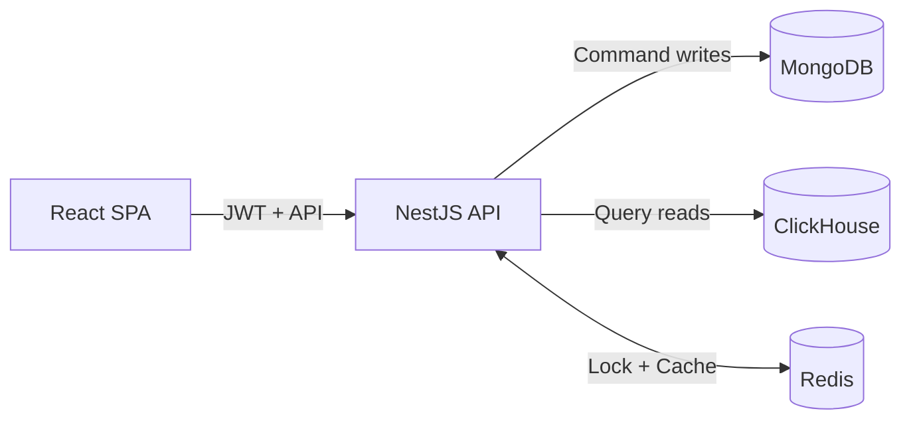
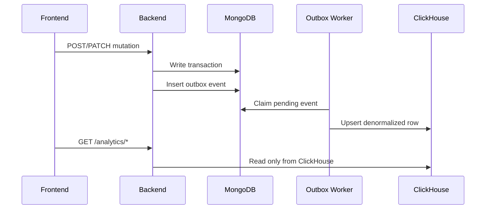

# PromoCode Manager

Мини-приложение для управления промокодами и аналитики с CQRS:
- запись (`command`) -> MongoDB;
- чтение таблиц (`query`) -> ClickHouse;
- Redis -> lock + cache.

## Быстрый старт

### Требования
- Docker + Docker Compose v2
- Node.js 20+
- npm 10+

### 1) Подготовить `.env`
```bash
cp .env.example .env
cp backend/.env.example backend/.env
cp frontend/.env.example frontend/.env
```

### 2) Поднять инфраструктуру
```bash
docker compose up -d
```

### 3) Запустить backend
```bash
cd backend
npm install
npm run start
```

### 4) Запустить frontend
```bash
cd frontend
npm install
npm run dev
```

### 5) Открыть приложение
- Frontend: `http://localhost:5173`
- Backend API: `http://localhost:3000/api`
- Swagger UI: `http://localhost:3000/api/docs`

## Что есть в приложении
- регистрация/логин (JWT access + refresh);
- CRUD пользователей и промокодов;
- создание заказа и отдельное применение промокода;
- 3 аналитические таблицы (users/promocodes/promo-usages) с server-side фильтрацией, сортировкой и пагинацией;
- глобальный фильтр дат (Today / 7d / 30d / Custom).

## Архитектура в 30 секунд
- все мутации проходят через MongoDB;
- после мутации создается outbox-событие и реплицируется read-model в ClickHouse;
- аналитические endpoint'ы читают только ClickHouse;
- Redis используется для distributed lock (`apply-promocode`) и кэша аналитики.

Детали: [ARCHITECTURE.md](ARCHITECTURE.md)

### Контур системы


### Синхронизация MongoDB -> ClickHouse


### ClickHouse таблицы
- `users` — профиль пользователя + агрегаты для аналитики пользователей.
- `promocodes` — параметры промокодов + метрики эффективности.
- `orders` — заказы с денормализованными полями пользователя/промокода.
- `promo_usages` — история применений промокодов.

### Server-side подход
- пагинация: `page`, `pageSize`;
- сортировка: `sortBy`, `sortDir`;
- фильтрация по колонкам: `filters`;
- глобальный фильтр дат: `dateFrom`, `dateTo`.

## Быстрые проверки

### Backend
```bash
cd backend
npm run typecheck
npm test
```

### Frontend
```bash
cd frontend
npm run typecheck
npm run build
```

### Инфраструктура
```bash
docker compose ps -a
docker compose exec -T clickhouse clickhouse-client --user pcm_user --password pcm_password --query "SHOW TABLES FROM promo_code_manager"
```

## Документация
- карта документации: [docs/README.md](docs/README.md)
- Swagger UI (из аннотаций Nest): `http://localhost:3000/api/docs`
- OpenAPI snapshot: [docs/openapi.yaml](docs/openapi.yaml)
- API в кратком виде: [docs/API_CONTRACTS.md](docs/API_CONTRACTS.md)
- схема ClickHouse: [docs/CLICKHOUSE_SCHEMA.md](docs/CLICKHOUSE_SCHEMA.md)
- техстек: [docs/TECH_STACK.md](docs/TECH_STACK.md)

## Остановка
```bash
docker compose down
```
